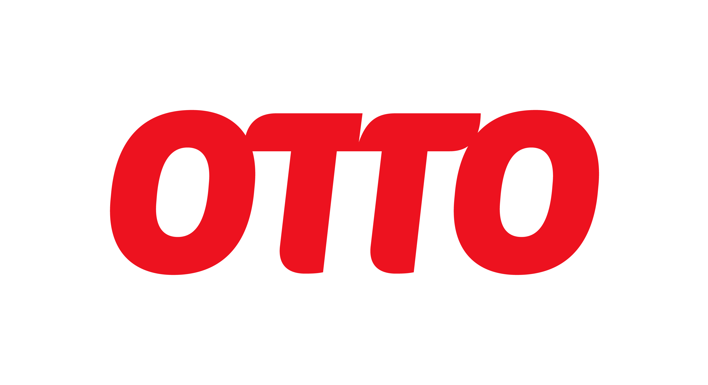

# Welcome to OTTO Open Source!

Welcome to out open source space on GitHub! We are excited to share our projects and collaborate with the global developer community.
Our vision is "Responsible commerce that inspires" and we believe open source is a key part of achieving this.

## About Us

OTTO is the largest online fashion and lifestyle retailer for end consumers in Germany - and currently on its way to become an e-commerce platform.
As part of the Otto Group, we are committed to innovation and sustainability in the retail sector.
We encourage our employees to work on open source projects, fostering a culture of collaboration and innovation.

## Get Involved

We welcome contributions from everyone. Whether you're fixing bugs, improving documentation, or proposing new features, your input is valuable to us.

## Stay Connected

- **Company website**: [OTTO](https://www.otto.de/unternehmen)
- **Tech**: [OTTO Tech Blog](https://dev.otto.de)
- **Shop**: [OTTO Shop](https://www.otto.de)
- **LinkedIn**: [LinkedIn](https://www.linkedin.com/company/otto-gmbh-&-co-kg)

## License

Most projects are licensed under the [Apache License 2.0](LICENSE), but please check individual repositories for specific licensing information.

<!--

**Here are some ideas to get you started:**

🙋‍♀️ A short introduction - what is your organization all about?
🌈 Contribution guidelines - how can the community get involved?
👩‍💻 Useful resources - where can the community find your docs? Is there anything else the community should know?
🍿 Fun facts - what does your team eat for breakfast?
🧙 Remember, you can do mighty things with the power of [Markdown](https://docs.github.com/github/writing-on-github/getting-started-with-writing-and-formatting-on-github/basic-writing-and-formatting-syntax)
-->
